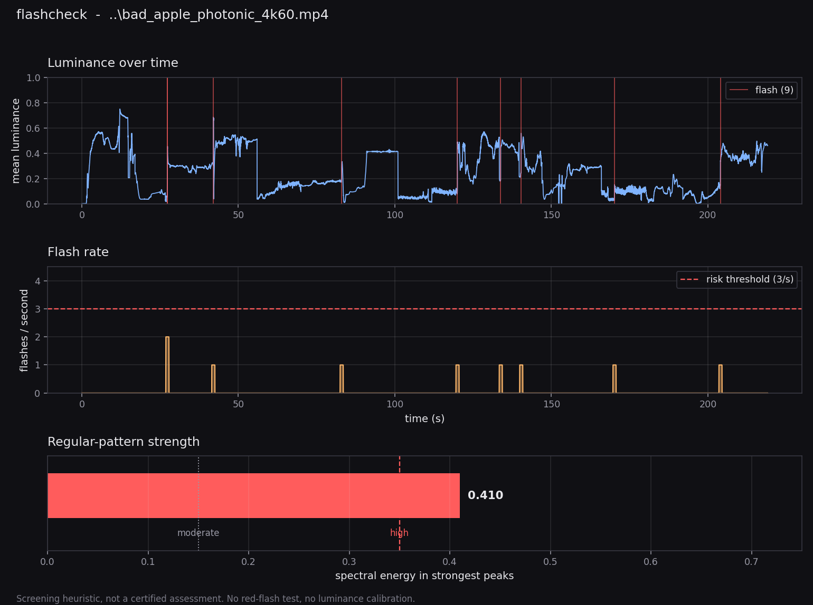

# flashcheck

A small command-line tool that screens video files for content likely to
trigger photosensitive seizures — rapid luminance flashes and strong
regular patterns.

I built it while producing a video made entirely from optical and photonic
simulations. The output contained interference fringes, diffraction
lattices and speckle, and I wanted to know whether it was safe to publish
before putting it online. Eyeballing it was not good enough, so I wrote
something that measures.

---

## What it measures

**Luminance flashes.** For every consecutive frame pair the tool computes
the change in mean luminance and the fraction of the frame that changed.
A transition counts as a flash when the mean luminance changes by more
than 10% *and* more than 25% of the frame area is affected. It then
reports the highest number of flashes occurring within any one-second
window. More than three is the threshold where risk is generally
considered significant.

**Regular patterns.** Striped and checkerboard patterns are a separate
trigger mechanism from flashing, and high-contrast periodic structure is
the main risk in fringe-heavy content. The tool takes the 2-D Fourier
transform of sampled frames and reports what fraction of the spectral
energy sits in the strongest peaks. Concentrated energy means strong
periodic structure.

Both checks are inspired by the thresholds used in ITU-R BT.1702 and
WCAG 2.3.1.

---

## Usage

```bash
python flashcheck.py video.mp4

# machine-readable output
python flashcheck.py video.mp4 --json report.json

# visual report
python flashcheck.py video.mp4 --plot report.png
```

Requires `ffmpeg` on the path, plus `numpy`. The `--plot` option
additionally needs `matplotlib`.



Example output:

```
[video] 13146 frames, 60.0 fps, 219.1 s

[luminance] total flashes: 9
[luminance] busiest one-second window: 2
  >>> low risk: flashes present but below threshold
  busiest moments (s): 27.4, 27.8

[pattern] regular-pattern strength: 0.410
  >>> HIGH: strong periodic structure (stripe/pattern sensitivity risk)

[advice]
  Add a photosensitivity warning to this video,
  in the description and in the opening seconds.

  Note: this is a screening heuristic, not a certified
  assessment. See README for limitations.
```

---

## Validation

Thresholds are only meaningful if the tool gives the right answer on
content whose risk profile is known by construction. `make_validation.py`
generates a reference set of synthetic clips:

```bash
python validate.py
```

It generates the clips on first run and checks the tool against them:

```
clip                 flash/s  verdict  pattern   verdict   result
-----------------------------------------------------------------
01_safe_gradient           0     none    0.000       low   pass
02_strobe_10hz            15     high    0.000       low   pass
03_flash_2hz               3      low    0.000       low   pass
04_moving_grating          0     none    0.963      high   pass
05_static_grating          0     none    0.937      high   pass

all 5 checks passed
```

Exit code is non-zero if any check fails, so it drops straight into CI.

Building this reference set caught two real bugs:

- **Flashes were double-counted.** The published guidance defines a flash
  as a light-dark-light *cycle*; counting every transition made a 2 Hz
  square wave report five flashes per second instead of two, tipping it
  over the threshold. The tool now counts rising transitions only.
- **Featureless frames scored as patterned.** A near-uniform frame has no
  structure, but its spectrum is numerical noise, and the strongest peaks
  of near-zero noise still form a large share of a near-zero total. A flat
  gradient was reporting "moderate" pattern strength. Frames below a
  minimum contrast are now scored zero.

If you change a threshold, re-run the reference set.

---

## Limitations — please read

This is a **screening heuristic, not a certified assessment.** It is not
an implementation of the Harding test and it does not replace one. If you
are producing broadcast content, or anything where compliance matters,
use a certified tool and a qualified assessor.

Specifically:

- **No red-flash test.** Saturated red transitions are a distinct and
  well-documented trigger with its own threshold. This tool does not
  check for them.
- **No luminance calibration.** Real thresholds are defined in cd/m² at
  the display, and in degrees of visual angle. The tool works in relative
  pixel values on a downscaled frame, so its "25% of the area" is screen
  area, not visual angle.
- **Thresholds are approximate.** The 10% / 25% / 3-per-second figures
  are drawn from published guidance, but the exact definitions in the
  standards are more specific than what is implemented here.
- **The pattern score is a heuristic.** Spectral peak concentration
  correlates with visible periodic structure, but the 0.35 cut-off is my
  own calibration, not a standard value.

A "low risk" result from this tool is not a clearance. When in doubt, add
a warning — it costs nothing and it matters to people who need it.

---

## Why bother

Photosensitive epilepsy affects a small fraction of people, but the
consequences of getting it wrong are serious, and most of us publishing
video have no idea whether our content is risky. A rough measurement is a
great deal better than a guess, and it takes seconds to run.

If you work with generated or simulated imagery — shader art, data
visualisation, procedural animation — this class of content is unusually
likely to produce exactly the patterns that matter here.

---

## License

MIT. Use it, fork it, improve it. Pull requests adding the red-flash test
or proper luminance calibration are especially welcome.
